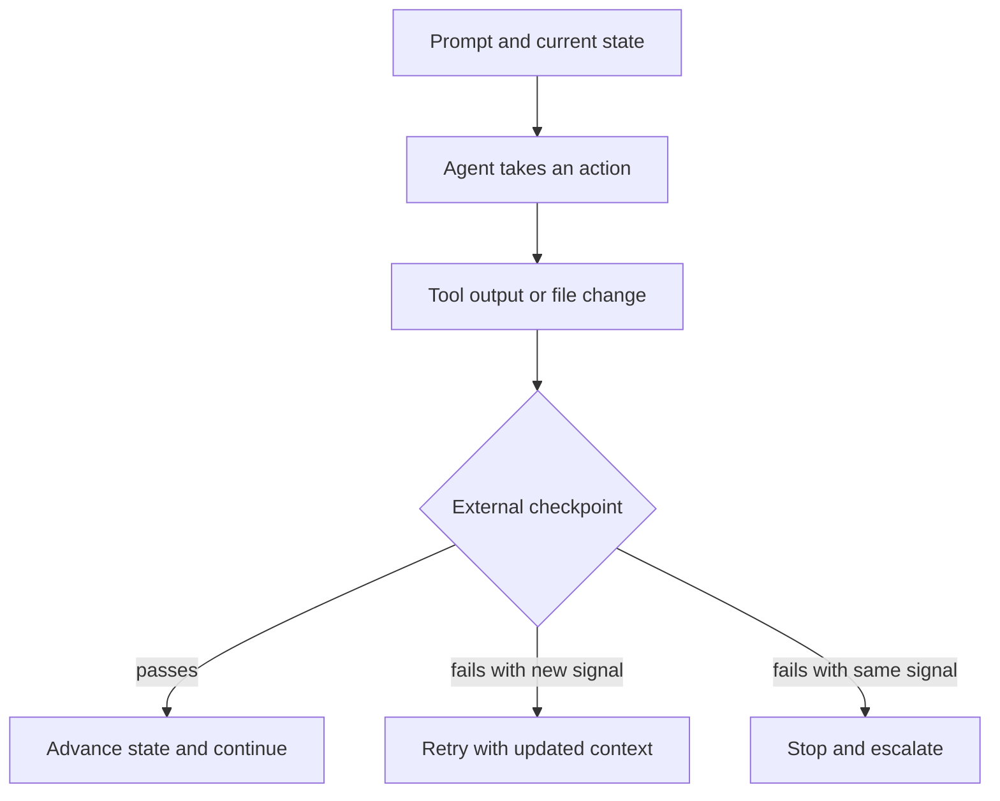

# 2.1 Geoffrey Huntley's "I'm in Danger" Feedback Loops

> **How to read this chapter:** Understand the shape of a healthy agent loop and the three warning signs of a bad one: repeated failures, no external checkpoint, and stale context. Memorize the checkpoint pattern. Treat the rest as reference material you can revisit when you start wiring agents to real tools.

## Why this section matters

A coding agent rarely fails because of one bad answer. It fails because it can keep acting after a bad answer.

That is the heart of the "I'm in danger" loop: the model makes a mistake, reads its own mistake as fresh input, and then turns one wrong step into a long, expensive sequence of wrong steps. Geoffrey Huntley's Ralph-loop framing is useful because it pushes us to judge an agent by the quality of its feedback loop, not by the confidence of any one response.

## Deliverable

By the end of this section, the reader can:

- describe a Ralph loop in one sentence,
- detect loop stagnation from a short execution history, and
- add one external checkpoint that stops an agent from repeating the same failure forever.

## The loop in one picture



> **Key idea:** A loop is healthy when each pass produces new information. A loop is unhealthy when it keeps spending tokens and tool calls without changing the state of the problem.

## Concept loop 1: one bad step becomes a bad cycle

Imagine an agent trying to list a file that does not exist. If the orchestration layer only says "try again," nothing changes between attempts. The second try is not really new work; it is the first mistake replayed.

### Worked example

Three attempts with the same command are enough to spot the pattern:

| Attempt | Command | Result |
| --- | --- | --- |
| 1 | `ls docs/missing.md` | `No such file or directory` |
| 2 | `ls docs/missing.md` | `No such file or directory` |
| 3 | `ls docs/missing.md` | `No such file or directory` |

The point is not that `ls` failed. The point is that the loop learned nothing.

### Example 2-1. Detecting stagnation from recent history

```python
def stagnating(history, window=3):
    recent = history[-window:]
    return len(recent) == window and len(set(recent)) == 1


history = [
    "ls docs/missing.md -> no such file",
    "ls docs/missing.md -> no such file",
    "ls docs/missing.md -> no such file",
]

print(stagnating(history))
```

Observed output during verification:

```text
True
```

### Check yourself

If attempt 3 changed to `ls docs/chapter_tracker.md -> success`, would the loop still be stagnating? Why not?

## Concept loop 2: external backpressure is the real safety feature

A model can claim that it has fixed the issue. That claim is not a checkpoint. A checkpoint is something outside the model's own narration: a test result, a diff review, an exit code, or a human decision.

### Worked example

Suppose an agent says, "I corrected the path." We still do not know whether the path exists. A single external check settles the question:

- `0` means the command succeeded.
- nonzero means the command failed.

That is a small example of backpressure. The loop does not advance because the agent feels done; it advances because the environment says the last step worked.

### Example 2-2. Stop after repeated identical failures

```python
def should_escalate(history, window=3):
    recent = history[-window:]
    return len(recent) == window and len(set(recent)) == 1


attempts = [
    "exit=2:path missing",
    "exit=2:path missing",
    "exit=2:path missing",
]

if should_escalate(attempts):
    print("escalate: repeated identical failure")
else:
    print("continue")
```

Observed output during verification:

```text
escalate: repeated identical failure
```

> **Warning:** A loop that only records the agent's own summaries can hide stagnation. Record raw tool signals, not just polished explanations.

### Check yourself

What is the smallest external checkpoint you could add to an agent that edits files and runs tests?

## Concept loop 3: fresh context beats bloated context

Beginners often assume that adding more prior conversation always helps. In practice, long loops become fragile when they keep feeding the model old guesses, irrelevant logs, and outdated plans. A Ralph-style workflow stays sharper by carrying forward only durable state: the goal, the last verified result, and the next action.

### Worked example

Compare these two retry prompts:

1. **Bad retry:** "Here are the last 60 messages. Please continue."
2. **Better retry:** "Goal: make the path check pass. Last verified result: `docs/missing.md` does not exist. Next action: inspect the docs directory and choose the correct file."

The second prompt is shorter, but it contains more usable information because it preserves state instead of preserving chatter.

### Example 2-3. A compact loop state record

```yaml
goal: confirm the correct documentation path
last_verified_result: docs/missing.md does not exist
next_action: list docs/ and select the matching file
escalate_if:
  - the same failure appears three times in a row
```

### Check yourself

Which field in the YAML block prevents the next iteration from pretending that the missing path problem was already solved?

## What we built

We built a tiny mental model for reliable agent loops:

1. detect repeated failures,
2. require external checkpoints, and
3. carry forward only verified state.

That is enough to explain why the Ralph-loop style is attractive: it turns "agent reliability" from a personality judgment into an engineering problem.

## Updated file layout

```text
docs/
  chapter_tracker.md
  references.md
  book_style.md
  part1/
    2.1 I'm in Danger Feedback Loops.md
scratchpad.md
agents.md
```

## Verification checklist

- [x] Ran `Example 2-1` from `./src` and confirmed it prints `True`.
- [x] Ran `Example 2-2` from `./src` and confirmed it prints `escalate: repeated identical failure`.
- [x] Confirmed this section links cleanly from `docs/chapter_tracker.md`.

## Wrapping up

The Ralph loop is not magic. It is a disciplined way to keep an agent honest by forcing every iteration to face the outside world. Once that idea is in place, the next section can ask a sharper question: what kinds of failure make agents hallucinate in circles even when they appear busy?

## Exercises

1. Write down one failure signal from your own workflow that should cause an agent to stop instead of retry.
2. Take a long prompt you have used before and rewrite it as a compact state record with goal, last verified result, and next action.
3. Explain to a teammate why repeated identical failures are more important than the number of total retries.
